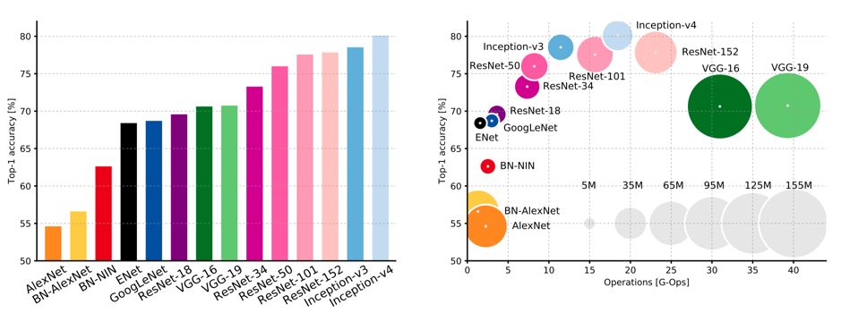
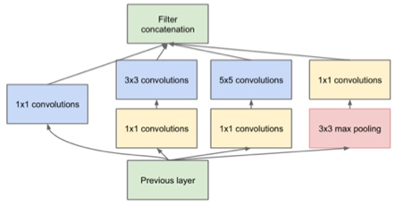

# **iNaturalist 2019 Challenge Competition**
These codes built for the Competition of iNaturalist 2019 at FGVC6

## **DATASET DESCRIPTION**

The iNaturalist Challenge 2019 dataset (the iNat dataset) contains two folders and three json files(https://www.kaggle.com/c/inaturalist-2019-fgvc6/data):

* train_val2019 folder - Contains 268,243 training and validation images in a directory structure following {iconic category name}/ {category name}/ {image id}.jpg.

* test2019 folder - Contains a single directory of 35,350 test images.

* test2019.json - Contains test image information.

* train2019.json - Contains the training annotations.

* val2019.json - Contains the validation annotations.

The images contain six kinds of creatures: Fungi, Plants, Insects, Amphibians, Reptiles and Birds, which are then divided into more specific sub-classes. Some creatures, such as Plants, includes as many as 682 sub-classes while some creatures, such as Fungi, includes only 11 sub-classes. There are 1010 sub-classes in total. All images are provided in the JPEG format and resized to have a maximum dimension of 800 pixels. 

The size of the dataset exceeds 82GB. Since the GPU of spartan server which is the only hardware support of this project has only 12GB memory, it is hardly to train the original dataset on this GPU. To read data efficiently, the TFRecords has been used to cache the data-preprocessing. With using the TFRecords, the original dataset has been reshaped and serialized to three kind of dimensions, 299*299, 512*512 and 800*800, and the size of the datasets are reduced to 5.2GB, 12.1GB, 25.7GB respectively.

## **EXISTING METHODS**

In the field of computer vision, the main method to increase the accuracy of deep learning model is to make deeper and deeper neural networks in the past. However, it has several problems such as overfitting, superabundant parameters. In 2012 ImageNet classification challenge, AlexNet (Krizhevsky et al., 2012), which is the first entry that used a Deep Neural Network (DNN) (Canziani et al, 2017), made a breakthrough in this competition (Russakovsky et al., 2015). With the emergence of DNNs, the accuracy figures of the competitions like the ImageNet classification challenge have steadily increased. 

Since the pre-trained models are allowed in the competition, finding a suitable training model is very crucial. Like the ImageNet classification challenge, the ultimate goal of the iNaturalist Challenge is to obtain the highest accuracy in a multi-class classification problem framework. Therefore, the DNNs is the potential solutions for the project.

Canziani et al. (2017) analysed multiple DNNs submitted to the ImageNet challenge in terms of accuracy, parameters and other indexes. The Figure 1 (Canziani et al, 2017),  show the Top-1 accuracy of the ImageNet classification challenge versus network, amount of operations required for a single forward pass and parameters. 

**Figure 1: The Top-1 accuracy vs. network (left) operations, size ∝ parameters (right)**

**(The size of the blobs is proportional to the number of network parameters)**

Apparently, the inception series models have the highest accuracy among any other models according to the figure. 

**Inception series models**

Until 2014, GoogLeNet put forward a new concept to merge the convolution kernel by a “Bottleneck Layer” to solve the problem mentioned above and this new model is Inception V1 (Ioffe & Szegedy, 2015).

**Figure 2: The kernel structure of Inception V1**

Inception V1 use structure shows as the Figure 1 and sequentially connect them together. However, this model is still easy to overfit and it also have too many parameters. In 2015, GoogleNet put forward Inception V2 and V3 models. In Inception V2 model (Szegedy et al., 2016), the alternative for one 5 × 5 kernel is to use two 3 × 3 size kernels to process the same image portion with less training parameters. Also, the batch normalization layers are added and n × n convolution is replaced by several 1 × n or n × 1 convolutions. Furthermore, comparing with the Inception V2, the Inception V3 model applies the convolution and pooling layer in parallel structure instead of putting them in sequence to reduce the dimension to diminish the target image size (Szegedy et al., 2016). 

**Table 1: Parameters of Inception V3**

| **Total Parameters**           | 21,802,784 |
| ------------------------------ | ---------- |
| **Trainable   Parameters**     | 21,768,352 |
| **Non-trainable   Parameters** | 34.432     |

Inception v1 use structure shows as the Figure 2 and sequentially connect them together. However, this model is still easy to overfit and it also have too many parameters. In 2015, GoogleNet put forward Inception v2 and v3 models. In Inception v2 model (Szegedy et al., 2016), the alternative for one 5 × 5 kernel is to use two 3 × 3 size kernels to process the same image portion with less training parameters. Also, the batch normalization layers are added and n × n convolution is replaced by several 1 × n or n × 1 convolutions. Furthermore, comparing with the Inception v2, the Inception v3 model applies the convolution and pooling layer in parallel structure instead of putting them in sequence to reduce the dimension to diminish the target image size (Szegedy et al., 2016). 

Szegedy et al. (2017) achieve 3.08% top-5 error on the test set of the ImageNet classification (CLS) challenge by using Inception v4 model. Inception v4 replaces the sequential connection of CNN layers and Pooling layers into stem module, in order to achieve deeper structure (Szegedy et al, 2017).

The Inception ResNet series model (Szegedy et al., 2017) came from the Inception series model by adding the ResNet residual structure. It has two versions, Inception ResNet v1 and Inception ResNet v2, which were derived from Inception v3 and Inception v4 respectively. Compared with the original Inception model, the Inception ResNet model added the shortcut structure and applied the linear 1×1 kernel to align the dimension.

## **POTENTIAL SOLUTION**

The potential solution is using the Inception ResNet v2 which is a hybrid Inception version that has best performance currently and a similar computational cost to Inception-v4. Since the Spartan provides limited source, we chose the Inception v3 model (Szegedy et al., 2016) as the second choice, which is much cheaper than Inception-v4 in computational cost. 

**Table 2: Parameters of Inception v3 and Inception ResNet v4**

| **Model**                  | **Inception** **v3** | **Inception ResNet v2** |
| -------------------------- | -------------------- | ----------------------- |
| Total Parameters           | 21,802,784           | 54,336,736              |
| Trainable Parameters       | 21,768,352           | 54,276,192              |
| Non-trainable   Parameters | 34.432               | 60,544                  |

